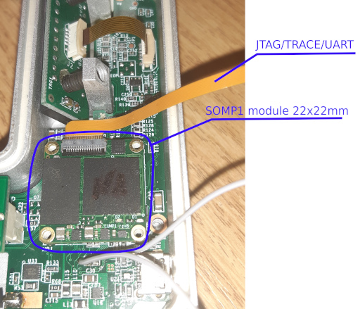
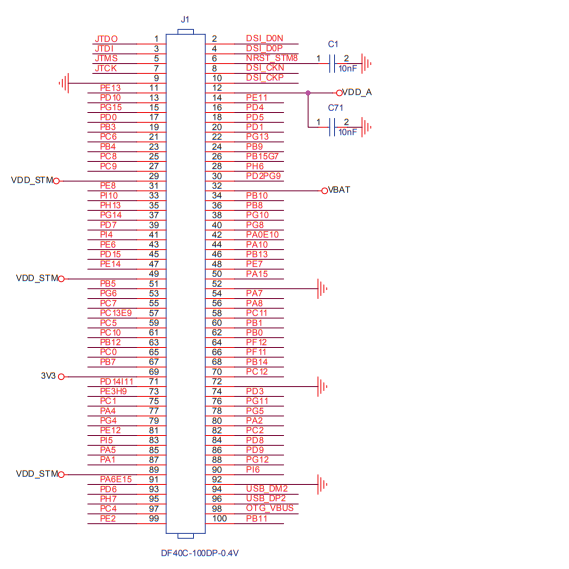

# SOMP1

## History

We ([Clear-tex](http://www.clear-tex.com) and [Metralight](http://www.metralight.com)) 
used to use MCU and FPGA for our products (mainly optics based sensors).

When our [Portable](https://www.metralight.com/our-products/laser-micrometers/portable/) 
product reached hundeds of kB of C and Lua code it became clear we need 
some OS to keep adding features.
Experiments with (then) brand new STM32MP157 CPU revealed some differences
to MCU world. You need to do your DDR3 connections right to keep it running
fast and without EMI. And you need more expensive multilayer PCBs.

We needed a SOM. But we have only about 30x30mm space for it which is way
too small place.
Thus we decided for in-house design of SOM for our products.

## Module Integration Concepts

### Integrated devices

The SOMP1 is designed as add-on PCB with 100pin DF40 connector. It is better for
small batches and prototyping when compared to stamp-like design. As bonus you 
get extra PCB space under the module (we often place ETH PHY there).
SOM integrates CPU, DDR3, QSPI NAND flash, switching power regulators and controlling
small STM8 MCU (to gain some extra flexibility and work around reset related errata).

### Is there PHY ?

There is no ETH PHY because we have designs without ETH, with 100MBit PHY, with
gigabit PHY and also with integrated switch chips. Connecting external PHY is
simple.

### Debug port

There is extra debug port as you can see on image. It is 16pin 0.5mm pitch flex
and sports NRST, JTAG, 4bit wide trace port, USART1 (for loader/Linux console) 
and VDD.
We found it very handy - even if main 100pin connector has JTAG too we use this
integrated one almost exclusively. Also it saves you space on main PCB.

We even use this port for new SOM bringup. Whole module (and integrated STM8 too)
can be (re)programmed solely via this port.

### Main connector

It is single F40C-100DP-0.4V(51), HIROSE connector. Recently I have seen SOMs
with two of them. We tried it at begining but it is very complicated to get
them aligned on both PCBs and make sure there is no tension between them when
SOM is populated.
Because the first SOMP1 usage was in automotive design, we wanted to stay on
safe side.
It is also reason for 4 holes for stands (we use very nice SMT ones from Wurth).
When you need to be sure there is no [fretting corrosion](https://en.wikipedia.org/wiki/Fretting)
in vibration environments then rigid fixing is the simplest option.

### Where theory meets praxis

Of course now we have only 100 pins. There is 0.3A allowed per pin so we dedicated
3 pins for VDDSTM. It can go from 2.6 to 3.6V and is main power for MP1's VDD and
buck switchers of VINT and DDR domains.
3V3 line is dedicated to USB (and LEDs) - you need at least 3.1V there. In battery
designs we sometimes split them. But for simple design keep them connected.

VBAT and VDDA are self explaining, see STM32MP1 DS for ranges. It is worth to note
that we expect small (about 10nF) capacitors to GND as close as possible to conn
pins (expecially pin 6 and 12). 
It is because we use them as reference high frequency ground for signals (DSI for
example).

Now we have 79 pins remaining. Which ones should we pin-out ? We created 17 prototypical
designs where each used different subsets of STM32MP1 peripheries.
We then formulated mathematical [MILP problem](https://en.wikipedia.org/wiki/Integer_programming)
which states that we want to select some pins whose will maximize number of possible
designs. After a few days of solver run we found that there is nice solution if we
connect some STM32MP1 ball pairs to the same DF40 pin (see `PA6E15` at pin `91` for example).

And yes, I've teached the solver that no very fast signal can be at paired pin.
